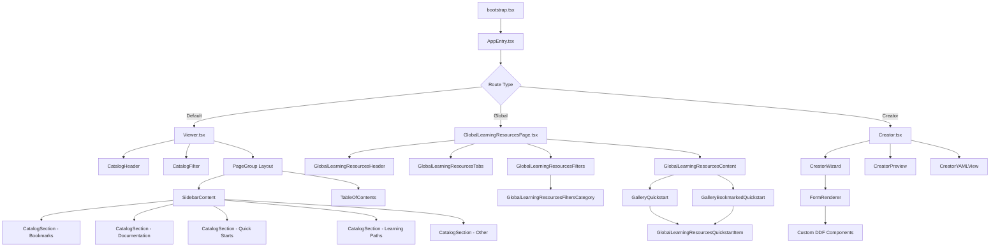
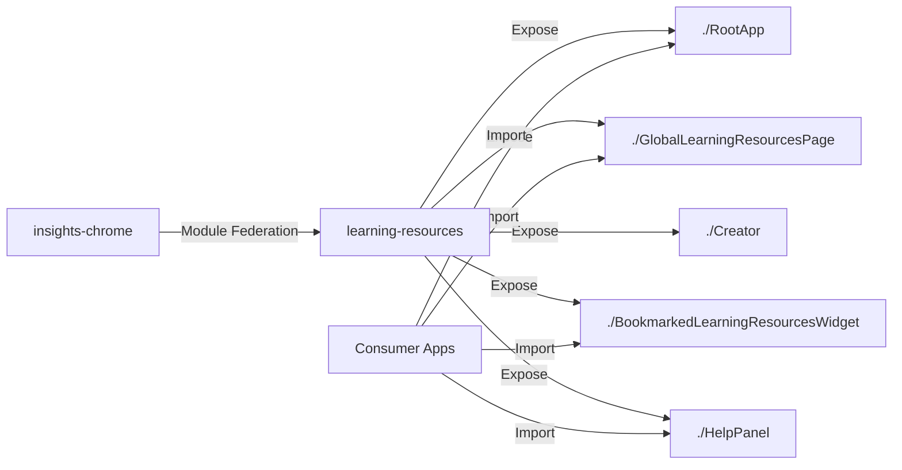
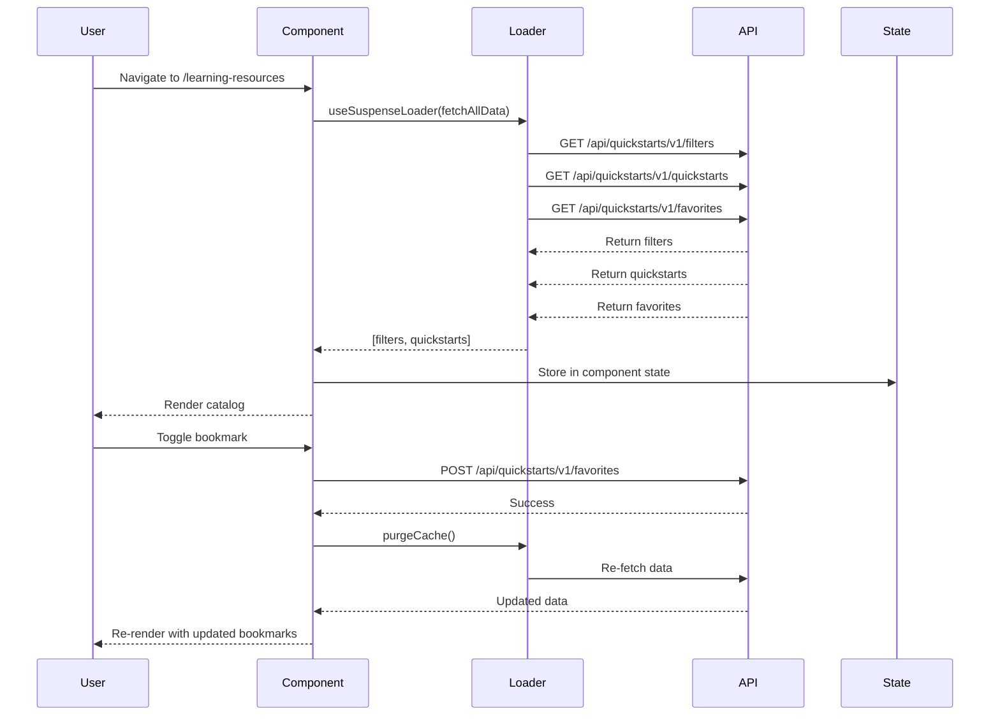
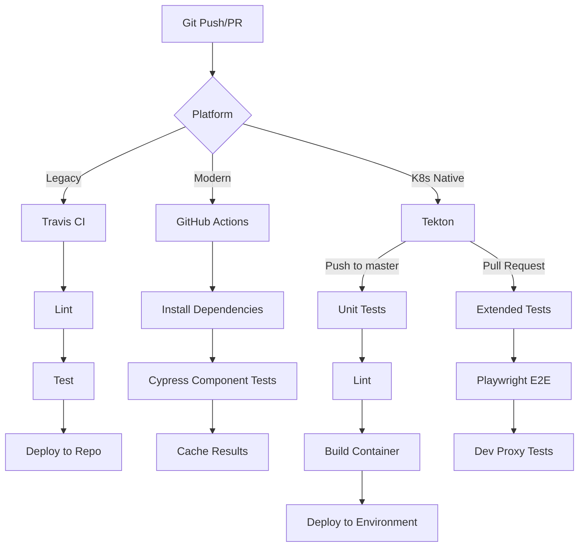

# Learning Resources - Technical Reference

> Comprehensive technical documentation for the Learning Resources application

**Version:** 1.1.0
**Last Updated:** February 2026

## Table of Contents

- [Application Overview](#application-overview)
  - [Purpose](#purpose)
  - [Key Features](#key-features)
  - [Target Users](#target-users)
- [Technical Stack](#technical-stack)
  - [Core Dependencies](#core-dependencies)
  - [Development Tools](#development-tools)
- [Architecture](#architecture)
  - [Component Hierarchy](#component-hierarchy)
  - [Module Federation](#module-federation)
  - [State Management](#state-management)
  - [Data Flow](#data-flow)
- [Deployment](#deployment)
  - [Build Configuration](#build-configuration)
  - [CI/CD Pipeline](#cicd-pipeline)
  - [Environments](#environments)
- [Data Structures](#data-structures)
  - [Core Types](#core-types)
  - [API Integration](#api-integration)
- [Routing and Navigation](#routing-and-navigation)
  - [Supported Routes](#supported-routes)
  - [Navigation Strategy](#navigation-strategy)
- [Feature Flags](#feature-flags)
- [Filtering and Search](#filtering-and-search)
  - [Filter Categories](#filter-categories)
  - [Search Implementation](#search-implementation)
- [Testing Strategy](#testing-strategy)
  - [Unit Tests](#unit-tests)
  - [Component Tests](#component-tests)
  - [E2E Tests](#e2e-tests)
- [Key Files Reference](#key-files-reference)

---

## Application Overview

### Purpose

The Learning Resources application is a React-based frontend for the Red Hat Hybrid Cloud Console that provides a unified, searchable catalog of learning materials and educational resources. It serves as an educational hub where Red Hat users can discover, bookmark, and access various learning content including quick starts, documentation, learning paths, and other educational resources.

**Repository:** https://github.com/RedHatInsights/learning-resources

### Key Features

**User-Facing Features:**
- **Resource Discovery:** Browse categorized learning materials across multiple product families
- **Advanced Search & Filtering:** Full-text search with multi-faceted filtering by product families, content types, and use cases
- **Bookmarking:** Save favorite resources for quick access (feature-flagged with Unleash)
- **Multiple View Modes:**
  - Simple catalog view (`Viewer.tsx`)
  - Advanced global view with comprehensive filtering (`GlobalLearningResourcesPage.tsx`)
- **Responsive Design:** Mobile and desktop layouts using PatternFly design system

**Admin Features:**
- **Resource Creation Wizard:** Multi-step form for creating new learning resources
- **Live Preview:** Real-time preview of resource cards during creation
- **YAML Editor:** Direct YAML editing with Monaco Editor
- **YAML Export:** Download generated YAML files for submission

> **For content creators:** See the [Creator Guide](./CREATOR_GUIDE.md) for detailed instructions on creating learning resources with the Wizard and YAML Editor.

### Target Users

- **Primary Users:** Red Hat Hybrid Cloud Console users seeking learning materials
- **Administrators:** Content creators and maintainers who add new learning resources
- **Platform Integration:** The application is consumed by insights-chrome via module federation

---

## Technical Stack

### Core Dependencies

**Frontend Framework:**
```json
{
  "react": "^18.3.1",
  "react-dom": "^18.3.1",
  "typescript": "^5.9.3",
  "react-router-dom": "^6.30.2"
}
```

**UI Components & Design System:**
```json
{
  "@patternfly/react-core": "^6.4.0",
  "@patternfly/react-table": "^6.4.0",
  "@patternfly/quickstarts": "^6.4.0",
  "@data-driven-forms/react-form-renderer": "^4.1.4",
  "@data-driven-forms/pf4-component-mapper": "^4.1.4"
}
```

**Cloud Services & Federation:**
```json
{
  "@redhat-cloud-services/frontend-components": "^6.1.1",
  "@redhat-cloud-services/frontend-components-utilities": "^6.1.1",
  "@scalprum/react-core": "^0.11.1"
}
```

**Feature Management & HTTP:**
```json
{
  "@unleash/proxy-client-react": "^4.5.2",
  "axios": "^1.13.2"
}
```

**Editor:**
```json
{
  "monaco-editor": "^0.55.1",
  "@monaco-editor/react": "^4.7.0"
}
```

**Utilities:**
```json
{
  "react-intl": "^6.6.2",
  "classnames": "^2.5.1",
  "yaml": "^2.8.1"
}
```

### Development Tools

**Build & Compilation:**
- **FEC (Frontend Components):** Red Hat's frontend build tooling
- **Webpack:** Module bundler with Module Federation Plugin
- **SWC:** Fast TypeScript/JSX compiler (via `@swc/jest` and `@swc/core`)
- **ts-patch:** TypeScript plugin support for custom transformations

**Testing:**
- **Jest** v29.7.0 with `ts-jest` and `@swc/jest`
- **Cypress** v14.5.4 for component testing
- **Playwright** for E2E testing
- **@testing-library/react** v14.3.1 and **@testing-library/jest-dom** v5.17.0

**Code Quality:**
- **ESLint** v8.57.1 with `@redhat-cloud-services/eslint-config-redhat-cloud-services`
- **TypeScript** v5.9.3 with strict mode enabled
- **Prettier** for code formatting
- **StyleLint** for CSS/SCSS linting

---

## Architecture

### Component Hierarchy

The application follows a modular component architecture with clear separation of concerns:



**Key Components:**

| Component | Path | Purpose |
|-----------|------|---------|
| `bootstrap.tsx` | `/src/bootstrap.tsx:1` | App initialization - renders to DOM element with id "root" |
| `AppEntry.tsx` | `/src/AppEntry.tsx:1` | Entry point with Suspense wrapper for data loading |
| `Viewer.tsx` | `/src/Viewer.tsx:1` | Simple catalog view with sections and table of contents |
| `GlobalLearningResourcesPage.tsx` | `/src/components/GlobalLearningResourcesPage/GlobalLearningResourcesPage.tsx:1` | Advanced view with tabs and multi-faceted filtering |
| `Creator.tsx` | `/src/Creator.tsx:1` | Resource creation wizard with form and YAML editor |
| `LearningResourcesWidget.tsx` | `/src/components/LearningResourcesWidget/LearningResourcesWidget.tsx:1` | Bookmarked resources widget for module federation |
| `HelpPanel` | `/src/components/HelpPanel/index.ts:1` | Help drawer with tabbed interface |

### Module Federation

The application uses Webpack Module Federation to expose components for consumption by the insights-chrome platform and other applications.

**Configuration:** `fec.config.js`

```javascript
moduleFederation: {
  exposes: {
    './RootApp': './src/AppEntry.tsx',
    './BookmarkedLearningResourcesWidget': './src/components/LearningResourcesWidget/LearningResourcesWidget',
    './GlobalLearningResourcesPage': './src/components/GlobalLearningResourcesPage/GlobalLearningResourcesPage',
    './Creator': './src/Creator.tsx',
    './HelpPanel': './src/components/HelpPanel/index.ts'
  },
  shared: [
    { 'react-router-dom': { singleton: true, version: '*' } }
  ]
}
```



**Exposed Modules:**

| Module | Entry Point | Use Case |
|--------|-------------|----------|
| `./RootApp` | `AppEntry.tsx` | Main application mounted in console routes |
| `./GlobalLearningResourcesPage` | `GlobalLearningResourcesPage.tsx` | Standalone page component with full filtering |
| `./Creator` | `Creator.tsx` | Admin interface for creating resources |
| `./BookmarkedLearningResourcesWidget` | `LearningResourcesWidget.tsx` | Widget for displaying bookmarked items |
| `./HelpPanel` | `HelpPanel/index.ts` | Help drawer content for chrome integration |

### State Management

The application uses **modern React hooks** for state management instead of Redux:

**Local Component State:**
```typescript
// Filter state
const [filter, setFilter] = useState<string>('');
const [loaderOptions, setLoaderOptions] = useState<FetchQuickstartsOptions>({});

// Pagination
const [page, setPage] = useState(1);
const [perPage, setPerPage] = useState(20);

// Sorting
const [sortOrder, setSortOrder] = useState<SortOrder>(SortOrder.Ascending);
```

**Data Loading Pattern:**

The application uses `useSuspenseLoader` from `@redhat-cloud-services/frontend-components-utilities` for data fetching with Suspense:

```typescript
// src/AppEntry.tsx:3-11
import { suspenseLoader as useSuspenseLoader } from '@redhat-cloud-services/frontend-components-utilities/useSuspenseLoader';
import fetchAllData from './utils/fetchAllData';

const AppEntry = (props: { bundle: string }) => {
  const { loader, purgeCache } = useSuspenseLoader(fetchAllData);
  return (
    <Suspense fallback={<GlobalLearningResourcesContentFallback />}>
      <Viewer {...props} loader={loader} purgeCache={purgeCache} />
    </Suspense>
  );
};
```

**Memoization for Performance:**

```typescript
// src/hooks/useQuickStarts.ts:55-91
const state = useMemo(() => {
  return quickstarts.sort(sortFnc).reduce<{
    bookmarks: ExtendedQuickstart[];
    documentation: ExtendedQuickstart[];
    quickStarts: ExtendedQuickstart[];
    other: ExtendedQuickstart[];
    learningPaths: ExtendedQuickstart[];
  }>(
    (acc, curr) => {
      if (filter && !filterFunction(filter, curr)) {
        return acc;
      }

      if (curr.metadata.favorite) {
        acc.bookmarks.push(curr);
      }
      if (curr.metadata.externalDocumentation) {
        acc.documentation.push(curr);
      } else if (curr.metadata.otherResource) {
        acc.other.push(curr);
      } else if (curr.metadata.learningPath) {
        acc.learningPaths.push(curr);
      } else {
        acc.quickStarts.push(curr);
      }

      return acc;
    },
    {
      documentation: [],
      quickStarts: [],
      other: [],
      learningPaths: [],
      bookmarks: [],
    }
  );
}, [quickstarts, filter, favorites]);
```

**Context API:**

Used for deeper component trees to avoid prop drilling:

```typescript
// src/components/creator/context.ts:5-13
export const CreatorWizardContext = React.createContext<{
  files: CreatorFiles;
  onChangeCurrentStage: (stage: CreatorWizardStage) => void;
  resetCreator: () => void;
}>({
  files: [],
  onChangeCurrentStage: () => {},
  resetCreator: () => {},
});
```

### Data Flow

The application follows a unidirectional data flow pattern:



**Data Fetching Functions:**

| Function | Path | Purpose |
|----------|------|---------|
| `fetchAllData` | `/src/utils/fetchAllData.ts:6` | Orchestrates parallel fetching of filters and quickstarts |
| `fetchQuickstarts` | `/src/utils/fetchQuickstarts.ts:41` | Fetches quickstarts with user account context |
| `fetchFilters` | `/src/utils/fetchFilters.ts:6` | Fetches filter category metadata |
| `toggleFavorite` | `/src/utils/toggleFavorite.ts:13` | Toggles bookmark status via API |

---

## Deployment

### Build Configuration

**Frontend Configuration:** `fec.config.js`

```javascript
const appUrl = [
  '/learning-resources',
  '/learning-resources/creator',
  '/settings/learning-resources',
  '/openshift/learning-resources',
  '/ansible/learning-resources',
  '/insights/learning-resources',
  '/edge/learning-resources',
  '/iam/learning-resources',
];

module.exports = {
  appUrl,
  debug: true,
  useProxy: true,
  proxyVerbose: true,
  sassPrefix: '.learning-resources, .learningResources',
  hotReload: process.env.HOT === 'true',
  moduleFederation: { /* ... */ },
};
```

**Webpack Configuration for Cypress:** `config/webpack.cy.js`

- Uses `swc-loader` for fast TypeScript/JSX transpilation
- Configures SCSS support via `sass-loader`
- Sets up Module Federation Plugin with Chrome container
- Handles asset loading (images, fonts, etc.)

### CI/CD Pipeline

The application uses multiple CI/CD platforms for comprehensive testing and deployment:



**Travis CI Configuration:** `.travis.yml`

```yaml
language: node_js
node_js: 18
stages:
  - lint
  - test
  - deploy

jobs:
  include:
    - stage: lint
      script: npm run lint
    - stage: test
      script: npm test
    - stage: deploy
      script: npm run deploy
```

**GitHub Actions:** `.github/workflows/test.yml`

- Node.js version: 20
- Jobs: install → test-component
- Caches npm modules and Cypress binary
- Runs Cypress component tests with custom webpack setup

**Tekton Pipelines:**

1. **Push Pipeline** (`.tekton/learning-resources-push.yaml`):
   - Triggered on push to master
   - Container image: `quay.io/redhat-user-workloads/hcc-platex-services-tenant/learning-resources`
   - Runs: `npm install` → `npm run lint` → `npm test`
   - Builds and deploys container image

2. **Pull Request Pipeline** (`.tekton/learning-resources-pull-request.yaml`):
   - Extended testing with Playwright E2E tests
   - Dev proxy with Caddy configuration
   - Test credentials integration
   - Storage: 3Gi for comprehensive testing

### Environments

**Deployment Environments:**

| Environment | Purpose | Deployment |
|-------------|---------|------------|
| **CI** | Continuous integration | Automatic on merge to master |
| **QA** | Quality assurance testing | Manual or scheduled |
| **Prod** | Production | Manual approval required |

**OpenShift Frontend CRD:** `deploy/frontend.yml`

```yaml
apiVersion: v1
kind: Template
metadata:
  name: learning-resources
objects:
  - apiVersion: cloud.redhat.com/v1alpha1
    kind: Frontend
    metadata:
      name: learning-resources
    spec:
      envName: ${ENV_NAME}
      title: learning-resources
      deploymentRepo: https://github.com/RedHatInsights/learning-resources-build
      module:
        manifestLocation: /apps/learning-resources/fed-mods.json
        modules:
          - id: learning-resources
            module: ./RootApp
            routes:
              - pathname: /learning-resources
              - pathname: /learning-resources/creator
```

**Navigation Segments:**

The application integrates into multiple bundles with navigation segments:

- **Ansible Bundle:** Position 8 in navigation
- **Insights Bundle:** Position 14
- **Edge Bundle:** Position 14
- **IAM Bundle:** Position 1
- **Settings Bundle:** Position 0
- **OpenShift Bundle:** Position 14

---

## Data Structures

### Core Types

**ExtendedQuickstart Interface:**

`src/utils/fetchQuickstarts.ts:11-25`

```typescript
export interface Tag {
  kind: string;
  value: string;
}

export interface TaggedMetadata extends ObjectMetadata {
  tags: Tag[];
  favorite?: boolean;
  externalDocumentation?: boolean;
  otherResource?: boolean;
  learningPath?: boolean;
}

export interface ExtendedQuickstart extends QuickStart {
  metadata: TaggedMetadata;
}
```

**QuickStart Spec (from @patternfly/quickstarts):**

```typescript
interface QuickStart {
  metadata: {
    name: string;
    [key: string]: any;
  };
  spec: {
    displayName: string;
    description?: string;
    type?: string;
    duration?: number;
    link?: {
      href: string;
      text?: string;
    };
    tasks?: Task[];
    [key: string]: any;
  };
}
```

**Filter Data Structures:**

`src/utils/FiltersCategoryInterface.ts:1-29`

```typescript
export interface FilterItem {
  id: string;
  filterLabel: string;
  cardLabel: string;
  color?: string;
  icon?: string;
}

export interface CategoryGroup {
  group: string;
  data: FilterItem[];
}

export type CategoryID = keyof FetchQuickstartsOptions;

export interface FiltersCategory {
  categoryId: CategoryID;
  categoryName: string;
  categoryData: CategoryGroup[];
  loaderOptions: FetchQuickstartsOptions;
  setLoaderOptions: React.Dispatch<React.SetStateAction<FetchQuickstartsOptions>>;
}

export interface FilterData {
  categories: FiltersCategory[];
}
```

**Fetch Options:**

`src/utils/fetchQuickstarts.ts:27-33`

```typescript
export type FetchQuickstartsOptions = {
  'product-families'?: string[];
  content?: string[];
  'use-case'?: string[];
  'display-name'?: string;
  bundle?: string;
};
```

### API Integration

**Base URL:** `/api/quickstarts/v1`

**Endpoints:**

| Method | Endpoint | Purpose | Query Parameters |
|--------|----------|---------|------------------|
| `GET` | `/quickstarts` | Fetch learning resources | `limit`, `account`, `product-families`, `content`, `use-case`, `display-name` |
| `GET` | `/favorites` | Fetch user bookmarks | `account` |
| `POST` | `/favorites` | Toggle bookmark status | `account` (query param), `{ quickstartName, favorite }` (body) |
| `GET` | `/quickstarts/filters` | Fetch filter metadata | None |

**API Implementation Examples:**

**Fetching Quickstarts:** `src/utils/fetchQuickstarts.ts:40-97`

```typescript
async function fetchQuickstarts(
  getUser: ChromeAPI['auth']['getUser'],
  { ['display-name']: displayName, ...options }: FetchQuickstartsOptions = {}
) {
  const user = await getUser();
  const account = user.identity.internal?.account_id;
  const quickstartsPath = `${API_BASE}${QUICKSTARTS}`;

  const contentPromise = axios
    .get<{ data: { content: ExtendedQuickstart }[] }>(quickstartsPath, {
      params: {
        limit: -1,  // No pagination
        account,
        ...options,
        ...(displayName?.trim() && {
          'display-name': displayName?.trim(),
        }),
      },
    })
    .then(({ data }) => {
      return data.data.map(({ content }) => content);
    });

  const favoritesPromise = account
    ? axios
        .get<{ data: FavoriteQuickStart[] }>(`${API_BASE}${FAVORITES}`, {
          params: { account },
        })
        .then(({ data }) => data.data)
    : Promise.resolve<FavoriteQuickStart[]>([]);

  const [content, favorites] = await Promise.all([
    contentPromise,
    favoritesPromise,
  ]);

  const hashMap: { [key: string]: boolean } = {};

  favorites.forEach((item) => {
    hashMap[item.quickstartName] = item.favorite;
  });

  return content.map((item) => {
    const name = item?.metadata?.name;
    return {
      ...item,
      metadata: {
        ...item?.metadata,
        favorite: !!hashMap[name],
      },
    };
  });
}
```

**Toggling Favorites:** `src/utils/toggleFavorite.ts:13-50`

```typescript
async function toggleFavorite(
  quickstartName: string,
  favorite: boolean,
  favorites: FavoriteQuickStart[],
  setFavorites: (favorites: FavoriteQuickStart[]) => void,
  chrome: ChromeAPI
) {
  // Optimistic update
  const originalFavorites = [...favorites];
  const newFavorites = favorites.filter(f => f.quickstartName !== quickstartName);
  if (favorite) {
    newFavorites.push({ favorite, quickstartName });
  }
  setFavorites(newFavorites);

  const user = await chrome.auth.getUser();
  const account = user.identity.internal?.account_id;

  try {
    await axios.post(`${API_BASE}${FAVORITES}?account=${account}`, {
      quickstartName,
      favorite,
    });
  } catch (error) {
    // Rollback on error
    setFavorites(originalFavorites);
  }
}
```

---

## Routing and Navigation

### Supported Routes

The application is mounted at multiple URL paths across different bundles:

| Route | Bundle | Description |
|-------|--------|-------------|
| `/learning-resources` | Default | Main catalog entry point |
| `/learning-resources/creator` | Default | Admin resource creation wizard |
| `/settings/learning-resources` | Settings | Learning resources in settings bundle |
| `/openshift/learning-resources` | OpenShift | OpenShift-specific learning resources |
| `/ansible/learning-resources` | Ansible | Ansible-specific learning resources |
| `/insights/learning-resources` | Insights | Insights-specific learning resources |
| `/edge/learning-resources` | Edge | Edge-specific learning resources |
| `/iam/learning-resources` | IAM | IAM-specific learning resources |

### Navigation Strategy

The application uses **URL search parameters** for internal navigation instead of traditional route definitions:

**Tab Navigation:** `src/components/GlobalLearningResourcesPage/GlobalLearningResourcesTabs.tsx:14-27`

```typescript
import { useSearchParams } from 'react-router-dom';

export enum TabsEnum {
  All = 'all',
  Bookmarks = 'bookmarks',
}

const GlobalLearningResourcesTabs = () => {
  const [searchParams] = useSearchParams();
  const activeTab = searchParams.get('tab') || TabsEnum.All;

  return (
    <Tabs activeKey={activeTab}>
      <Tab
        eventKey={TabsEnum.All}
        title={<TabTitleText>All resources</TabTitleText>}
      />
      <Tab
        eventKey={TabsEnum.Bookmarks}
        title={<TabTitleText>Bookmarks</TabTitleText>}
      />
    </Tabs>
  );
};
```

**Query Parameters:**
- `?tab=all` - Show all resources
- `?tab=bookmarks` - Show bookmarked resources only

**Navigation Example:**

```typescript
import { Link, useLocation } from 'react-router-dom';

<Link
  to={{
    pathname: location.pathname,
    search: `?tab=${TabsEnum.Bookmarks}`,
  }}
>
  View Bookmarks
</Link>
```

---

## Feature Flags

The application uses **Unleash** for feature flagging to enable gradual rollout and A/B testing.

**Integration:** `@unleash/proxy-client-react` v4.5.2

**Active Feature Flags:**

| Flag | Purpose | Location |
|------|---------|----------|
| `platform.learning-resources.bookmarks` | Controls visibility of bookmark feature | `src/Viewer.tsx:18` |
| `platform.chrome.quickstarts.creator` | Gates access to Creator module (requires permissions) | `deploy/frontend.yml` |

**Usage Example:** `src/Viewer.tsx:18-39`

```typescript
import { useFlag } from '@unleash/proxy-client-react';

const Viewer = () => {
  const showBookmarks = useFlag('platform.learning-resources.bookmarks');

  return (
    <PageGroup stickyOnBreakpoint={{ default: 'top' }}>
      {showBookmarks && (
        <>
          <CatalogSection
            title="Bookmarks"
            quickstarts={quickStarts.bookmarks}
            onToggleFavorite={handleToggleFavorite}
          />
          <Divider />
        </>
      )}
      {/* Other sections */}
    </PageGroup>
  );
};
```

**Multiple Flags:** `src/components/HelpPanel/HelpPanelCustomTabs.tsx:10-12`

```typescript
import { useFlags } from '@unleash/proxy-client-react';

const HelpPanelCustomTabs = () => {
  const flags = useFlags();
  const showAskRedHat = flags['platform.chrome.show-ask-red-hat'];

  // Use flags to conditionally render UI
};
```

**Flag Configuration in Deployment:**

Flags are checked in `deploy/frontend.yml` to control module routes:

```yaml
routes:
  - pathname: /learning-resources/creator
    featureFlag: platform.chrome.quickstarts.creator
```

---

## Filtering and Search

### Filter Categories

The application supports multi-faceted filtering across three main dimensions:

**Filter Categories:** `src/utils/FiltersCategoryInterface.ts:28-34`

```typescript
export const FiltersCategoryMetadata: Record<CategoryID, string> = {
  'product-families': 'Product families',
  content: 'Content type',
  'use-case': 'Use case',
  'display-name': 'Display name',
  bundle: '',
};
```

**Product Families:**
- Ansible
- OpenShift
- RHEL (Red Hat Enterprise Linux)
- IAM (Identity and Access Management)
- Settings
- Subscriptions Services

**Content Types:**
- Documentation
- Learning Paths
- Quick Starts
- Other Content Types

**Use Cases:**
- Automation
- Clusters
- Containers
- Data Services
- Deploy
- Identity and Access
- Images
- Infrastructure
- Observability
- Security
- Spend Management
- System Configuration

### Search Implementation

**Full-Text Search:** `src/hooks/useQuickStarts.ts:16-33`

```typescript
function filterFunction(filter: string, quickstart: ExtendedQuickstart) {
  const parsedFilter = filter.toLowerCase();
  const displayName = quickstart.spec.displayName.toLowerCase();
  const description = quickstart.spec.description
    ? quickstart.spec.description.toLowerCase()
    : '';
  const parsedTags = quickstart.metadata.tags
    .map((tag) => ({
      ...tag,
      value: tag.value.toLowerCase(),
    }))
    .join(' ');
  return (
    displayName.includes(parsedFilter) ||
    description.includes(parsedFilter) ||
    parsedTags.includes(parsedFilter)
  );
}
```

**Search Features:**
- Case-insensitive matching
- Searches across: display name, description, and tags
- Real-time client-side filtering (no API call needed)
- Combined with category filters (API-based)

**Filter Mapping:** `src/hooks/useFilterMap.ts:6-23`

```typescript
const useFilterMap = (filters: { data: FilterData }) => {
  const filterMap = useMemo(() => {
    const filterMap: FilterMap = {};
    filters.data.categories.forEach((category) => {
      filterMap[category.categoryId] = {};
      category.categoryData.forEach((dataGroup) => {
        dataGroup.data.forEach((filter) => {
          filterMap[category.categoryId][filter.id] = {
            id: filter.id,
            cardLabel: filter.cardLabel,
            filterLabel: filter.filterLabel,
            ...(filter.icon && { icon: filter.icon }),
          };
        });
      });
    });
    return filterMap;
  }, [filters]);

  return filterMap;
};
```

**Filter UI Component:** `src/components/GlobalLearningResourcesPage/GlobalLearningResourcesFiltersCategory.tsx`

- Renders expandable accordion with checkbox groups
- Updates `loaderOptions` state on filter toggle
- Triggers data re-fetch via `purgeCache()`

---

## Testing Strategy

### Unit Tests

**Configuration:** `jest.config.js`

```javascript
module.exports = {
  preset: 'ts-jest',
  testEnvironment: 'jsdom',
  coverageDirectory: './coverage/',
  collectCoverage: true,
  collectCoverageFrom: [
    'src/**/*.js',
    '!src/**/*.stories.js',
  ],
  transform: {
    '^.+\\.(ts|tsx|js|jsx)$': ['@swc/jest'],
  },
  moduleNameMapper: {
    '\\.(css|scss)$': 'identity-obj-proxy',
  },
  transformIgnorePatterns: [
    'node_modules/(?!uuid)',
  ],
  setupFilesAfterEnv: ['<rootDir>/config/jest.setup.js'],
};
```

**Running Tests:**

```bash
npm test                # Run all tests
npm run test:watch      # Watch mode
npm run test:coverage   # With coverage report
```

**Test Files Pattern:**
- `src/**/*.test.ts`
- `src/**/*.test.tsx`

### Component Tests

**Configuration:** `cypress.config.ts`

```typescript
import { defineConfig } from 'cypress';

export default defineConfig({
  component: {
    devServer: {
      framework: 'react',
      bundler: 'webpack',
      webpackConfig: require('./config/webpack.cy'),
    },
    specPattern: 'cypress/component/**/*.cy.{js,jsx,ts,tsx}',
  },
});
```

**Running Cypress:**

```bash
npm run cypress open         # Interactive mode
npm run cypress run          # Headless mode
npm run cypress:component    # Component tests only
```

**Test Files Pattern:**
- `cypress/component/**/*.cy.ts`
- `cypress/component/**/*.cy.tsx`

**Custom Webpack Config:** `config/webpack.cy.js`

- Uses `swc-loader` for fast TypeScript compilation
- Configures Module Federation with Chrome container
- Mocks CSS/SCSS imports

### E2E Tests

**Playwright Integration:**

E2E tests run in the Tekton PR pipeline using Playwright:

`.tekton/learning-resources-pull-request.yaml` (excerpt):

```yaml
- name: playwright-e2e
  image: mcr.microsoft.com/playwright:v1.40.0-jammy
  script: |
    #!/bin/bash
    set -e

    # Install dependencies
    npm ci

    # Install Playwright browsers
    npx playwright install --with-deps

    # Run E2E tests
    npm run test:e2e
```

**E2E Test Features:**
- Full browser automation (Chromium, Firefox, WebKit)
- Dev proxy with Caddy for API mocking
- Test credentials integration
- Screenshot and video recording on failure

**Running E2E Tests:**

```bash
npm run test:e2e              # Run all E2E tests
npm run test:e2e:headed       # With browser UI
npm run test:e2e:debug        # Debug mode
```

---

## Key Files Reference

### Core Application Files

| File | Purpose |
|------|---------|
| `/src/bootstrap.tsx` | App initialization - mounts React app to DOM element with id "root" |
| `/src/entry.ts` | Webpack entry point |
| `/src/AppEntry.tsx` | Main app component with Suspense wrapper for data loading |
| `/src/Viewer.tsx` | Simple catalog view with sections and table of contents |
| `/src/components/GlobalLearningResourcesPage/GlobalLearningResourcesPage.tsx` | Advanced view with comprehensive filtering and tabs |
| `/src/Creator.tsx` | Resource creation wizard with form, YAML editor, and preview |

### Data & API Files

| File | Purpose |
|------|---------|
| `/src/utils/fetchQuickstarts.ts` | Main data fetching with ExtendedQuickstart type definition |
| `/src/utils/fetchFilters.ts` | Filter metadata fetching from API |
| `/src/utils/fetchAllData.ts` | Orchestrates parallel fetching of filters and quickstarts |
| `/src/utils/toggleFavorite.ts` | Bookmark API integration with optimistic updates |
| `/src/utils/FiltersCategoryInterface.ts` | Filter category types and metadata definitions |
| `/src/utils/filtersInterface.ts` | Filter mapping interfaces and utilities |

### Hooks

| File | Purpose |
|------|---------|
| `/src/hooks/useQuickStarts.ts` | Hook to categorize quickstarts and apply text filtering |
| `/src/hooks/useFilterMap.ts` | Hook to build efficient filter lookup map |

### Components

| File | Purpose |
|------|---------|
| `/src/components/CatalogSection.tsx` | Expandable section with resource gallery |
| `/src/components/GlobalLearningResourcesPage/GlobalLearningResourcesQuickstartItem.tsx` | Individual resource card component |
| `/src/components/GlobalLearningResourcesPage/GlobalLearningResourcesFiltersCategory.tsx` | Checkbox-based category filter group |
| `/src/components/LearningResourcesWidget/LearningResourcesWidget.tsx` | Bookmarked resources widget for module federation |
| `/src/components/HelpPanel/HelpPanelContent.tsx` | Help drawer with tabbed interface |

### Configuration Files

| File | Purpose |
|------|---------|
| `/fec.config.js` | Frontend build configuration with module federation |
| `/package.json` | Dependencies, scripts, and project metadata |
| `/tsconfig.json` | TypeScript compiler configuration |
| `/jest.config.js` | Jest testing configuration |
| `/cypress.config.ts` | Cypress component testing configuration |
| `/config/webpack.cy.js` | Custom webpack config for Cypress |
| `/deploy/frontend.yml` | OpenShift Frontend CRD for deployment |

### CI/CD Files

| File | Purpose |
|------|---------|
| `/.travis.yml` | Travis CI pipeline configuration |
| `/.github/workflows/test.yml` | GitHub Actions workflow for component tests |
| `/.tekton/learning-resources-push.yaml` | Tekton push pipeline (master branch) |
| `/.tekton/learning-resources-pull-request.yaml` | Tekton PR pipeline with E2E tests |

### Type Definitions

| File | Purpose |
|------|---------|
| `/src/utils/fetchQuickstarts.ts` | ExtendedQuickstart, Tag, TaggedMetadata, FetchQuickstartsOptions |
| `/src/utils/FiltersCategoryInterface.ts` | FilterItem, CategoryGroup, FiltersCategory, FilterData |
| `/src/utils/filtersInterface.ts` | Filter, CategoryMap, FilterMap |
| `/src/utils/TabsEnum.ts` | TabsEnum for routing |

---

## Additional Resources

**Repository:** https://github.com/RedHatInsights/learning-resources

**Build Artifacts:** https://github.com/RedHatInsights/learning-resources-build

**Related Documentation:**
- [Creator Guide](./CREATOR_GUIDE.md) - Guide for creating learning resources using the Wizard and YAML Editor
- [PatternFly React Documentation](https://www.patternfly.org/v4/)
- [Red Hat Frontend Components](https://github.com/RedHatInsights/frontend-components)
- [Module Federation](https://webpack.js.org/concepts/module-federation/)
- [Unleash Feature Flags](https://docs.getunleash.io/)

---

**Document Version:** 1.0
**Last Updated:** February 2026
**Maintainer:** HCC Framework Team
