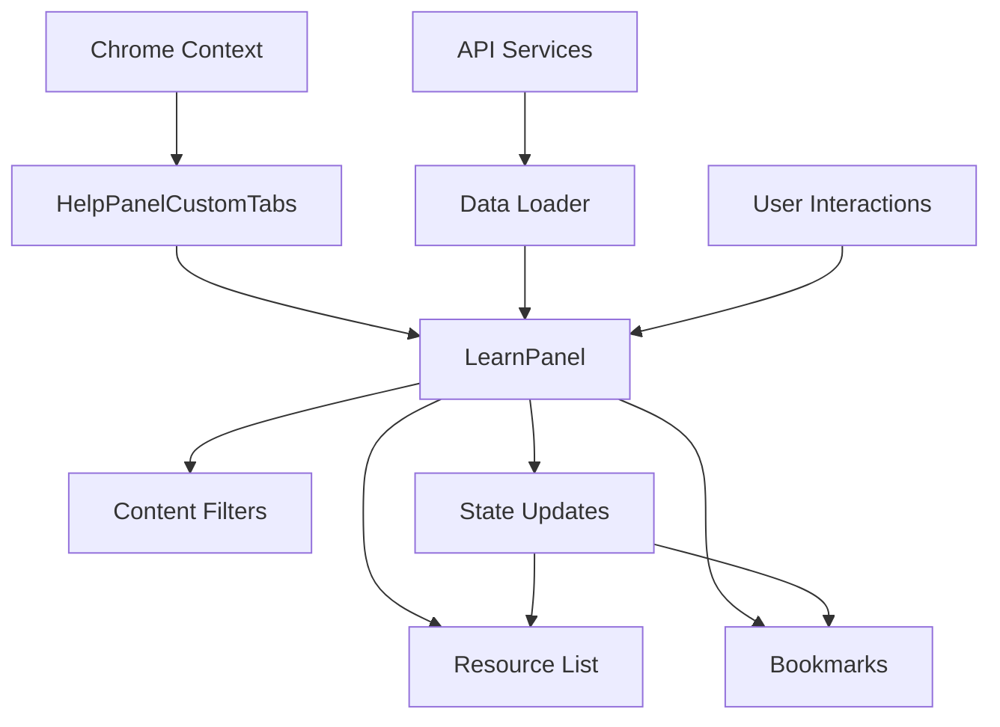

import { Meta } from '@storybook/addon-docs/blocks';

<Meta title="Documentation/Architecture" />

# Help Panel Architecture

This document outlines the architectural patterns, data flow, and integration points for the Help Panel system within the Red Hat Console.

## 🏗️ System Overview

The Help Panel is a contextual assistance system that provides learning resources, documentation, and support directly within the user's workflow. It's designed as a slide-out panel that adapts its content based on the current application context.

## 📊 Component Architecture

### Component Hierarchy

```
HelpPanelCustomTabs (Main Container)
├── Tab Navigation
│   ├── Learn Tab (Primary learning resources)
│   ├── Search Tab (Quick search functionality)
│   ├── API Tab (API documentation)
│   ├── Knowledge Base Tab (KB articles)
│   ├── Support Tab (Support resources)
│   ├── Virtual Assistant Tab (AI chat support)
│   ├── Feedback Tab (User feedback forms)
│   └── QuickStart Tabs (Dynamic tutorial tabs)
├── LearnPanel
│   ├── Content Type Filters
│   ├── Bookmark Management
│   ├── Resource List
│   ├── Pagination
│   └── Scope Toggle (All vs. Bundle-specific)
├── SearchPanel
│   ├── Search Input
│   ├── Recent Searches
│   └── Search Results
├── APIPanel
│   ├── API Documentation Browser
│   ├── Bundle-specific API Endpoints
│   ├── Code Examples
│   └── Authentication Info
├── KBPanel (Knowledge Base)
│   ├── Search Input
│   ├── Article Categories
│   └── Recent Articles
├── SupportPanel
│   ├── Support Case Management
│   ├── Contact Information
│   ├── Service Status
│   └── Community Resources
├── VAPanel (Virtual Assistant)
│   ├── AI Chat Interface
│   ├── Context-aware Assistance
│   └── Module Federation Integration
├── FeedbackPanel
│   ├── Feedback Forms
│   ├── Bug Reporting
│   └── Feature Requests
└── QuickStartsPanel (Dynamic)
    ├── Tutorial Content
    ├── Progress Tracking
    └── Navigation Controls
```

### Component Responsibilities

#### HelpPanelCustomTabs
- **Role**: Main container and tab coordination
- **Responsibilities**:
  - Tab navigation and state management
  - Integration with Chrome services
  - Feature flag handling
  - Responsive layout management
  - Dynamic tab creation for QuickStarts

#### LearnPanel
- **Role**: Learning resource discovery and management
- **Responsibilities**:
  - Content filtering and search
  - Bookmark management
  - Pagination and data loading
  - Context-aware content recommendation
  - Quick start tutorial access

#### SearchPanel
- **Role**: Universal search across all help content
- **Responsibilities**:
  - Search input handling
  - Search history management
  - Cross-panel content discovery
  - Search result presentation

#### APIPanel
- **Role**: API documentation and reference
- **Responsibilities**:
  - Bundle-specific API endpoint listing
  - Interactive API documentation
  - Code examples and samples
  - Authentication guidance

#### KBPanel (Knowledge Base)
- **Role**: Knowledge base article access
- **Responsibilities**:
  - Article search and filtering
  - Category-based browsing
  - Recent article tracking
  - External KB integration

#### SupportPanel
- **Role**: Customer support resources
- **Responsibilities**:
  - Support case management
  - Contact information display
  - Service status updates
  - Community forum access

#### VAPanel (Virtual Assistant)
- **Role**: AI-powered contextual assistance
- **Responsibilities**:
  - Chat interface management
  - Context-aware query processing
  - Module federation integration
  - Conversation history

#### FeedbackPanel
- **Role**: User feedback collection
- **Responsibilities**:
  - Feedback form rendering
  - Bug report submission
  - Feature request tracking
  - User sentiment analysis

#### QuickStartsPanel
- **Role**: Interactive tutorial delivery
- **Responsibilities**:
  - Tutorial content rendering
  - Progress state management
  - Step navigation
  - Completion tracking

## 🔄 Data Flow Architecture

### State Management



### Data Sources

#### Primary APIs
- **Learning Resources API** (`/api/quickstarts/v1/quickstarts`)
  - Quick start tutorials
  - Learning paths
  - Documentation links
  - Content metadata

- **User Preferences API** (`/api/quickstarts/v1/favorites`)
  - Bookmark management
  - User progress tracking
  - Personalization settings

#### Chrome Integration
- **Bundle Context** - Current application bundle (insights, automation, etc.)
- **User Authentication** - User identity and permissions
- **Feature Flags** - Conditional feature rendering
- **Analytics** - User behavior tracking

### Content Filtering Logic

```typescript
// Pseudo-code for content filtering
const filteredResources = useMemo(() => {
  let filtered = allQuickStarts;

  // Bundle-specific filtering
  if (activeToggle === 'bundle' && !isHomePage) {
    filtered = filtered.filter(resource =>
      resource.metadata.tags?.some(tag =>
        tag.kind === 'bundle' && tag.value === currentBundleId
      )
    );
  }

  // Content type filtering
  if (selectedContentTypes.length > 0) {
    filtered = filtered.filter(resource =>
      selectedContentTypes.some(type =>
        matchesContentType(resource, type)
      )
    );
  }

  // Bookmark filtering
  if (showBookmarkedOnly) {
    filtered = filtered.filter(resource =>
      resource.metadata.favorite
    );
  }

  return filtered;
}, [allQuickStarts, activeToggle, selectedContentTypes, showBookmarkedOnly]);
```

## 🔌 Integration Patterns

### Chrome Service Integration

```typescript
const chrome = useChrome();

// Authentication
const user = await chrome.auth.getUser();

// Analytics tracking
chrome.analytics.track('help_panel_interaction', {
  action: 'bookmark_toggle',
  resource_type: 'quickstart',
  bundle: bundleId
});

// Bundle context
const bundleData = chrome.getBundleData();
const availableBundles = chrome.getAvailableBundles();
```

### Feature Flag Integration

```typescript
const {
  'help.helppanel.learn': learnTabEnabled,
  'help.helppanel.search': searchTabEnabled
} = useFlags();

// Conditional rendering based on feature flags
{learnTabEnabled && <LearnPanel />}
```

### Internationalization Pattern

```typescript
const intl = useIntl();

// Message formatting with context
const contentTypeLabel = intl.formatMessage(messages.contentTypeLabel);
const resourceCountMessage = intl.formatMessage(
  messages.learningResourcesCountLabel,
  { count: filteredResources.length }
);
```

## 📱 Responsive Design Architecture

### Breakpoint Strategy

```scss
// Mobile-first responsive design
.help-panel {
  // Base mobile styles
  width: 100vw;

  @media (min-width: 768px) {
    // Tablet styles
    width: 400px;
  }

  @media (min-width: 1200px) {
    // Desktop styles
    width: 500px;
  }
}
```

### Adaptive Content Loading

- **Mobile**: Load essential content first, lazy load details
- **Desktop**: Rich content with preview capabilities
- **Touch Optimization**: Larger touch targets on mobile devices

## 🎨 Design System Integration

### PatternFly Components

```typescript
// Strategic use of PatternFly components
import {
  DataList,        // Resource listing
  Pagination,      // Content pagination
  Select,          // Content type filtering
  ToggleGroup,     // Scope selection
  Toolbar,         // Action controls
  Drawer          // Panel container
} from '@patternfly/react-core';
```

### Design Tokens

```scss
// Consistent spacing using PatternFly tokens
.help-panel-content {
  padding: var(--pf-v6-global--spacer--md);
  gap: var(--pf-v6-global--spacer--sm);
}

// Color schemes for different content types
.quickstart-item {
  border-left: 3px solid var(--pf-v6-global--primary-color--100);
}

.documentation-item {
  border-left: 3px solid var(--pf-v6-global--info-color--100);
}
```

## ⚡ Performance Optimization

### Data Loading Strategy

```typescript
// Suspense-based data loading
const { loader, purgeCache } = useSuspenseLoader(fetchAllData);

// Progressive loading with fallbacks
<Suspense fallback={<Spinner size="lg" />}>
  <LearnPanelContent />
</Suspense>
```

### Memoization Patterns

```typescript
// Expensive computations are memoized
const filteredResources = useMemo(() => {
  return performFiltering(allQuickStarts, filters);
}, [allQuickStarts, activeToggle, selectedContentTypes, showBookmarkedOnly]);

// Paginated results to avoid rendering large lists
const paginatedResources = useMemo(() => {
  const startIndex = (page - 1) * perPage;
  return filteredResources.slice(startIndex, startIndex + perPage);
}, [filteredResources, page, perPage]);
```

### Virtual Scrolling (Future Enhancement)

For large content lists, implement virtual scrolling to maintain performance:

```typescript
// Potential virtual scrolling implementation
import { FixedSizeList as VirtualList } from 'react-window';

const VirtualizedResourceList = ({ items, height }) => (
  <VirtualList
    height={height}
    itemCount={items.length}
    itemSize={80}
    itemData={items}
  >
    {LearningResourceItem}
  </VirtualList>
);
```

## 🔒 Security Considerations

### Data Validation

```typescript
// Input sanitization for search queries
const sanitizedQuery = DOMPurify.sanitize(userInput);

// Type validation for API responses
const validateQuickstart = (data: unknown): data is ExtendedQuickstart => {
  return quickstartSchema.safeParse(data).success;
};
```

### Permission Checking

```typescript
// Resource visibility based on user permissions
const visibleResources = resources.filter(resource =>
  userHasAccess(resource.metadata.requiredPermissions, userPermissions)
);
```

## 🧪 Testing Architecture

### Component Testing Strategy

```typescript
// Test component in isolation with mocked dependencies
const renderWithProviders = (component: React.ReactElement) => {
  return render(
    <IntlProvider locale="en" messages={testMessages}>
      <MockChromeProvider>
        {component}
      </MockChromeProvider>
    </IntlProvider>
  );
};
```

### Integration Testing

- **MSW Integration** - Mock API responses for realistic testing
- **User Journey Testing** - Complete workflow validation
- **Accessibility Testing** - Automated a11y validation

### Performance Testing

- **Bundle Size Monitoring** - Track component bundle impact
- **Render Performance** - Measure component render times
- **Memory Usage** - Monitor for memory leaks in long-running sessions

## 🚀 Future Architecture Considerations

### Micro-Frontend Integration

```typescript
// Potential federation for help content
const HelpContentModule = React.lazy(() =>
  import('help-content-mfe/HelpPanel')
);

// Dynamic content loading based on application
const getHelpModule = (bundleId: string) => {
  return import(`@${bundleId}/help-content`);
};
```

### Enhanced Personalization

- **ML-Based Recommendations** - Suggest content based on user behavior
- **Contextual AI Assistant** - Integrated chat-based help
- **Progressive Web App** - Offline help content capability

### Advanced Analytics

- **User Journey Tracking** - Complete user flow analytics
- **Content Effectiveness Metrics** - Measure help content success
- **A/B Testing Framework** - Optimize help panel effectiveness

## 📈 Scalability Patterns

### Content Management

- **CMS Integration** - Dynamic content updates without deployment
- **Version Management** - Content versioning and rollback capabilities
- **Localization Pipeline** - Automated translation workflows

### Performance Scaling

- **CDN Integration** - Global content delivery optimization
- **Caching Strategy** - Multi-level caching for content and user preferences
- **Load Balancing** - API request distribution for high availability