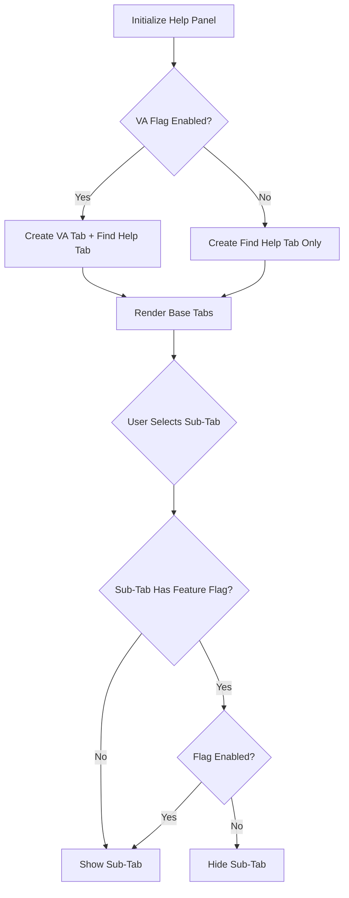
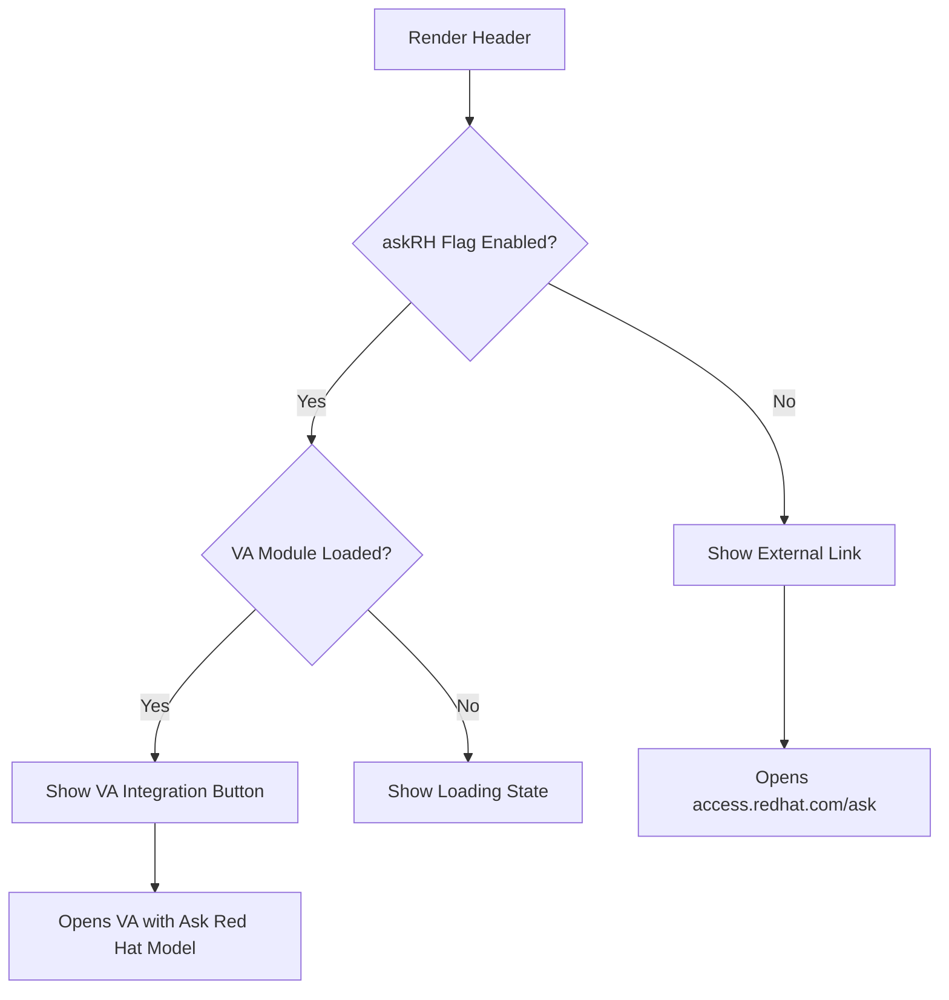

import { Meta } from '@storybook/addon-docs/blocks';

<Meta title="Documentation/Help Panel Architecture" />

# Help Panel Architecture

This document provides a comprehensive overview of the Help Panel architecture, components, and design patterns.

## 📐 Component Hierarchy

```
HelpPanelContent (Wrapper)
├── HelpPanelContentWrapper (Remote Module Loader)
│   └── HelpPanelContent (Core)
│       ├── DrawerHead
│       │   ├── Title
│       │   ├── Status Page Button (conditional)
│       │   └── DrawerActions
│       │       ├── Ask Red Hat Button (conditional)
│       │       └── DrawerCloseButton
│       └── DrawerPanelBody
│           └── HelpPanelCustomTabs
│               ├── Base Tabs
│               │   ├── Virtual Assistant Tab (conditional)
│               │   └── Find Help Tab
│               ├── Dynamic Tabs (user-created)
│               └── Tab Content
│                   ├── SubTabs (for non-VA tabs)
│                   │   ├── Search
│                   │   ├── Learn
│                   │   ├── Knowledge Base
│                   │   ├── APIs
│                   │   ├── My Support Cases
│                   │   └── Feedback
│                   └── HelpPanelTabContainer
│                       └── Tab Panel Components
```

## 🏗️ Core Components

### HelpPanelContent (`src/components/HelpPanel/HelpPanelContent.tsx`)

The main container component that provides:
- Remote module loading for Virtual Assistant integration
- Header with title and action buttons
- Tab navigation and content display

**Key Features:**
- Loads Virtual Assistant state and models via module federation
- Conditionally renders Ask Red Hat button based on feature flags
- Provides ref access to open tabs with custom content
- Shows "Loading..." state while remote modules load

**Feature Flag Dependencies:**
```javascript
// Status page location
const showStatusPageInHeader = searchFlag && kbFlag;

// Ask Red Hat button behavior
if (askRH) {
  // Opens VA with Ask Red Hat model
} else {
  // External link to access.redhat.com/ask
}
```

### HelpPanelCustomTabs (`src/components/HelpPanel/HelpPanelCustomTabs.tsx`)

The tab management component that implements:
- Dynamic tab creation and removal
- Tab state management
- Quick start integration
- Sub-tab navigation

**Key Responsibilities:**
1. **Tab Lifecycle Management**
   - Create base tabs (VA + Find Help)
   - Add/remove user-created tabs
   - Update tab titles dynamically
   - Handle tab closing with Quick Start state confirmation

2. **State Management**
   - Maintains active tab state
   - Tracks all open tabs
   - Manages Quick Start states
   - Synchronizes with external Quick Start open requests

3. **Feature Integration**
   - Quick Start loading and rendering
   - Virtual Assistant tab (feature flagged)
   - Custom content tabs (from HelpPanelLink)

**Tab Store Pattern:**
```javascript
// Mock store implementation (to be replaced with API)
const createTabsStore = (baseTabs) => {
  let tabs = [...baseTabs];
  const subscribers = new Map();

  return {
    addTab: (tab) => { /* ... notify subscribers */ },
    updateTab: (tab) => { /* ... notify subscribers */ },
    removeTab: (tabId) => { /* ... notify subscribers */ },
    subscribe: (callback) => { /* ... */ },
    getTabs: () => tabs,
  };
};
```

### HelpPanelTabContainer (`src/components/HelpPanel/HelpPanelTabs/HelpPanelTabContainer.tsx`)

Routes active tab type to the appropriate panel component using the `helpPanelTabsMapper`.

### Tab Panel Components

Each tab type has its own panel component:

| Tab Type | Component | Description |
|----------|-----------|-------------|
| `search` | `SearchPanel` | Full-text search across all content |
| `learn` | `LearnPanel` | Curated learning resources |
| `kb` | `KBPanel` | Knowledge base articles |
| `api` | `APIPanel` | API documentation browser |
| `support` | `SupportPanel` | Support case access |
| `va` | `VAPanel` | Virtual Assistant integration |
| `quickstart` | `QuickStartsPanel` | Interactive tutorials |
| `feedback` | `FeedbackPanel` | User feedback form |

## 🎯 Tab Types and States

### Tab Definition Structure

```typescript
type TabDefinition = {
  id: string;              // Unique identifier
  title: ReactNode;        // Display title
  tabTitle?: string;       // Alternative title text
  closeable?: boolean;     // Can user close this tab?
  tabType: TabType;        // Type of content
  isNewTab?: boolean;      // Track if originally a "New tab"
  customContent?: ReactNode; // Custom content from HelpPanelLink
  quickstartId?: string;   // Set when tabType is 'quickstart'
};
```

### Base Tabs vs Dynamic Tabs

**Base Tabs (Non-closeable):**
- Created on initialization
- Cannot be closed by user
- Virtual Assistant tab (if feature flag enabled)
- Find Help tab (always present)

**Dynamic Tabs (Closeable):**
- Created by user via "Add tab" button
- Created when opening Quick Starts
- Created via HelpPanelLink component
- Can be closed with confirmation if Quick Start is in progress

### Tab Creation Flow

```
User clicks "Add tab"
    ↓
Create tab with placeholder title "New tab"
    ↓
User selects sub-tab (e.g., Search)
    ↓
Tab title updates to match sub-tab
    ↓
User performs action (e.g., searches)
    ↓
Tab title updates to reflect action (debounced)
```

## 🔄 State Management Patterns

### Tab State Management

Uses a custom hook pattern with subscriber notifications:

```javascript
const useTabs = (apiStoreMock) => {
  const [tabs, dispatch] = useReducer(() => {
    return [...apiStoreMock.getTabs()];
  }, apiStoreMock.getTabs());

  useEffect(() => {
    const unsubscribe = subscribe(dispatch);
    return () => unsubscribe();
  }, []);

  return { tabs, addTab, updateTab, removeTab };
};
```

### Quick Start State Synchronization

Quick Starts can be opened from multiple locations:
- Learning Resources catalog
- Quick Starts tab in Help Panel
- External triggers

**Synchronization via Store:**
```javascript
// External component triggers open
openQuickstartStore.updateState('OPEN', { quickstartId, displayName });

// Help Panel listens and responds
useEffect(() => {
  const { pendingOpen } = openQuickstartState;
  if (!pendingOpen) return;

  // Find existing or create new tab
  const existing = tabs.find(t =>
    t.tabType === TabType.quickstart &&
    t.quickstartId === quickstartId
  );

  if (existing) {
    setActiveTab(existing);
  } else {
    addTab(newQuickStartTab);
  }

  openQuickstartStore.updateState('CONSUMED_OPEN');
}, [openQuickstartState.pendingOpen]);
```

## 🎨 Sub-Tab Navigation

### Sub-Tab Structure

Sub-tabs appear within closeable tabs to organize content types:

```javascript
const subTabs = [
  {
    title: 'Search',
    tabType: TabType.search,
    icon: <SearchIcon />,
    featureFlag: 'platform.chrome.help-panel_search',
  },
  {
    title: 'Learn',
    tabType: TabType.learn,
    // No feature flag - always available
  },
  {
    title: 'Knowledge base',
    tabType: TabType.kb,
    featureFlag: 'platform.chrome.help-panel_knowledge-base',
  },
  // ... more sub-tabs
];
```

### Sub-Tab Filtering

Sub-tabs are dynamically filtered based on feature flags:

```javascript
const filteredSubTabs = useMemo(() => {
  return subTabs.filter((tab) => {
    if (typeof tab.featureFlag === 'string') {
      return !!flags.find(({ name }) => name === tab.featureFlag)?.enabled;
    }
    return true; // No feature flag = always show
  });
}, [flags, subTabs]);
```

### Status Page Button Logic

The Status Page link appears in different locations based on feature flags:

```javascript
// In header (DrawerHead)
const showStatusPageInHeader = searchFlag && kbFlag;

// In sub-tabs
const showStatusPageButton = !searchFlag && !kbFlag;
```

**Logic:**
- **Both Search and KB enabled** → Status Page in header
- **Both disabled** → Status Page in sub-tabs
- **One enabled, one disabled** → No Status Page link

## 🔌 Module Federation Integration

### Virtual Assistant Loading

The Help Panel integrates with a remote Virtual Assistant module:

```javascript
// Load remote hook for VA state management
const { hookResult, loading } = useRemoteHook({
  scope: 'virtualAssistant',
  module: './state/globalState',
  importName: 'useVirtualAssistant',
});

// Load remote Models constant
const [module] = useLoadModule({
  scope: 'virtualAssistant',
  module: './state/globalState',
  importName: 'Models',
});
```

**Error Handling:**
- Shows "Loading..." while remote modules load
- Gracefully handles failed module loads
- VA tab only appears if `platform.chrome.help-panel_chatbot` flag is enabled

## 🎭 Feature Flag Control Flow

### Tab Visibility



### Ask Red Hat Button



## 🧪 Testing Considerations

### Key Test Scenarios

1. **Tab Management**
   - Create and close tabs
   - Switch between tabs
   - Close tab with in-progress Quick Start (modal confirmation)
   - Dynamic tab title updates

2. **Feature Flag Combinations**
   - All flags enabled
   - All flags disabled
   - Various combinations

3. **Quick Start Integration**
   - Open Quick Start from catalog
   - Open Quick Start from Help Panel
   - Handle duplicate open requests
   - Close Quick Start in progress

4. **Remote Module Loading**
   - VA module loads successfully
   - VA module fails to load
   - Timeout handling

5. **Sub-Tab Navigation**
   - Filter sub-tabs by feature flags
   - Status Page button location
   - Default tab selection

## 📊 Data Flow Diagrams

### Opening a Custom Tab via HelpPanelLink

```
Component with HelpPanelLink
    ↓
User clicks link
    ↓
HelpPanelLink calls openHelpPanelTab()
    ↓
Exposes ref method to HelpPanelCustomTabs
    ↓
openTabWithContent(content)
    ↓
Create or update tab with custom content
    ↓
Set as active tab
    ↓
HelpPanelTabContainer renders custom content
```

### Quick Start State Management

```
User clicks Quick Start in catalog
    ↓
openQuickstartInHelpPanelStore.updateState('OPEN', data)
    ↓
HelpPanelCustomTabs receives state update
    ↓
Check for existing Quick Start tab
    ↓
If exists: activate tab
    ↓
If not: create new tab, load Quick Start
    ↓
Mark state as 'CONSUMED_OPEN'
    ↓
Quick Start renders in tab
```

## 🔧 Extension Points

### Adding New Tab Types

1. Define new `TabType` enum value in `helpPanelTabsMapper.ts`
2. Create panel component (e.g., `NewPanel.tsx`)
3. Add to `helpPanelTabsMapper` object
4. Add to `subTabs` array with optional feature flag
5. (Optional) Add to `getSubTabTitle` helper for custom titles

### Custom Tab Content

Components can open custom tabs via `HelpPanelLink`:

```typescript
<HelpPanelLink
  content={{
    id: 'unique-id',
    title: 'Custom Tab',
    tabType: TabType.learn,
    content: <CustomComponent />,
  }}
>
  Click to open custom content
</HelpPanelLink>
```

## 🎯 Best Practices

### Performance
- Use `React.memo` for expensive panel components
- Lazy load Quick Starts only when needed
- Debounce title updates (currently 100ms)

### Accessibility
- All tabs have proper ARIA labels
- Keyboard navigation supported
- Focus management on tab switching

### State Management
- Keep tab state minimal and serializable
- Use subscriber pattern for tab store notifications
- Clear state on tab close

### Feature Flags
- Always provide fallback UI when flags are disabled
- Test all flag combinations
- Document flag dependencies in code comments

---

This architecture supports a flexible, extensible Help Panel system that can adapt to different feature configurations and user workflows.
