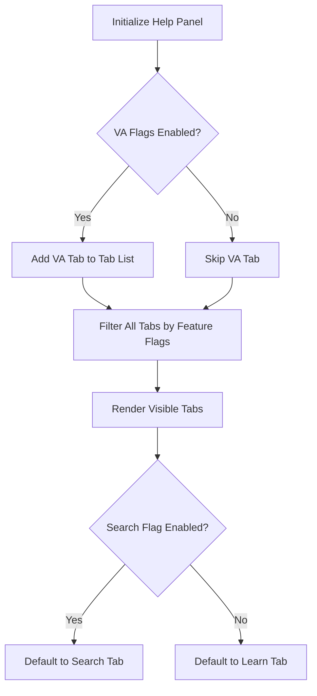
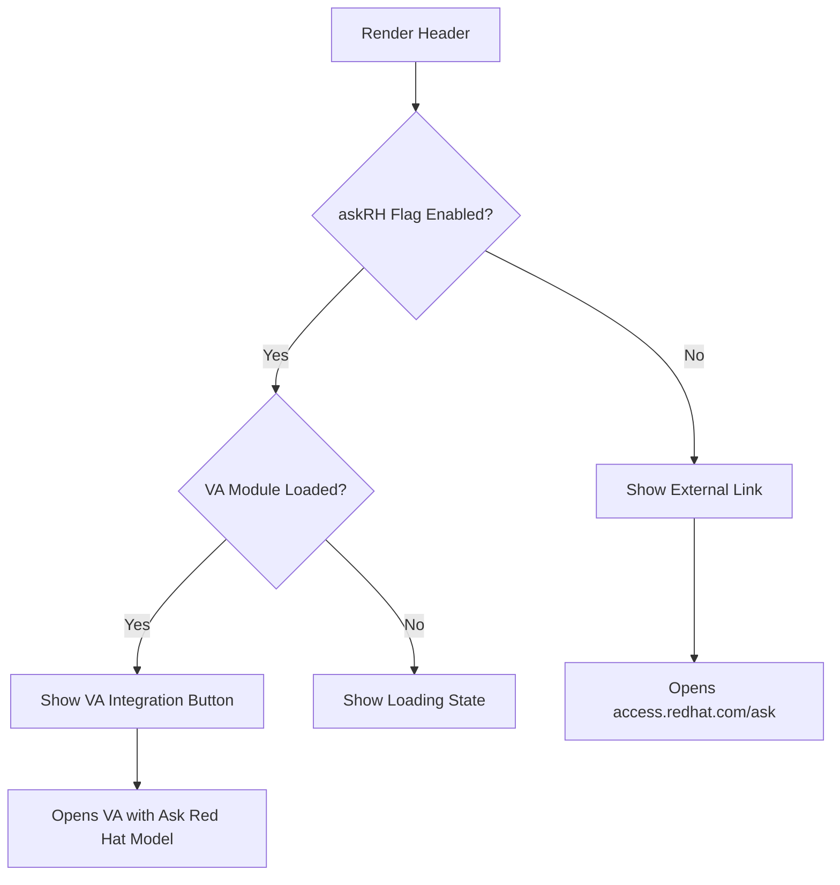

import { Meta } from '@storybook/addon-docs/blocks';

<Meta title="Documentation/Help Panel Architecture" />

# Help Panel Architecture

This document provides a comprehensive overview of the Help Panel architecture, components, and design patterns.

## 📐 Component Hierarchy

```
HelpPanelContent (Wrapper)
├── HelpPanelContentWrapper (Remote Module Loader)
│   └── HelpPanelContent (Core)
│       ├── DrawerHead
│       │   ├── Title
│       │   ├── Status Page Button (conditional)
│       │   └── DrawerActions
│       │       ├── Ask Red Hat Button (conditional)
│       │       └── DrawerCloseButton
│       └── DrawerPanelBody
│           └── HelpPanelCustomTabs
│               ├── Main Tabs (single tier)
│               │   ├── Search (feature flagged)
│               │   ├── Learn
│               │   ├── APIs
│               │   ├── Support
│               │   ├── Feedback
│               │   └── Virtual Assistant (feature flagged)
│               ├── Tab Content
│               │   └── HelpPanelTabContainer
│               │       └── Tab Panel Components
│               └── Quick Start Overlay (when active)
```

## 🏗️ Core Components

### HelpPanelContent (`src/components/HelpPanel/HelpPanelContent.tsx`)

The main container component that provides:
- Remote module loading for Virtual Assistant integration
- Header with title and action buttons
- Tab navigation and content display

**Key Features:**
- Loads Virtual Assistant state and models via module federation
- Conditionally renders Ask Red Hat button based on feature flags
- Shows "Loading..." state while remote modules load

**Feature Flag Dependencies:**
```javascript
// Status page location - always in header in single-tier structure
const showStatusPageInHeader = true;

// Ask Red Hat button behavior
if (askRH) {
  // Opens VA with Ask Red Hat model
} else {
  // External link to access.redhat.com/ask
}
```

### HelpPanelCustomTabs (`src/components/HelpPanel/HelpPanelCustomTabs.tsx`)

The single-tier tab navigation component that implements:
- Static tab rendering
- Tab selection state management
- Quick start overlay integration

**Key Responsibilities:**
1. **Tab Rendering**
   - Render static tabs based on feature flags
   - Filter tabs by feature flag availability
   - Maintain active tab state

2. **State Management**
   - Tracks currently active tab ID
   - Manages Quick Start overlay state
   - Handles Quick Start state confirmations

3. **Feature Integration**
   - Quick Start loading and rendering as overlay
   - Virtual Assistant tab (feature flagged)
   - Content-specific tabs filtered by feature flags

**Tab Structure:**
All tabs are now static and persistent. No add/close functionality exists.

```javascript
const createMainTabs = (showVA) => {
  const tabs = [
    { id: 'search', title: 'Search', tabType: TabType.search, featureFlag: 'platform.chrome.help-panel_search' },
    { id: 'learn', title: 'Learn', tabType: TabType.learn },
    { id: 'api', title: 'APIs', tabType: TabType.api },
    { id: 'support', title: 'Support', tabType: TabType.support },
    { id: 'feedback', title: 'Feedback', tabType: TabType.feedback },
  ];

  if (showVA) {
    tabs.push({ id: 'virtual-assistant', title: <AiChatbotIcon />, tabType: TabType.va });
  }

  return tabs;
};
```

### HelpPanelTabContainer (`src/components/HelpPanel/HelpPanelTabs/HelpPanelTabContainer.tsx`)

Routes active tab type to the appropriate panel component using the `helpPanelTabsMapper`.

### Tab Panel Components

Each tab type has its own panel component:

| Tab Type | Component | Description |
|----------|-----------|-------------|
| `search` | `SearchPanel` | Full-text search across all content |
| `learn` | `LearnPanel` | Curated learning resources |
| `api` | `APIPanel` | API documentation browser |
| `support` | `SupportPanel` | Support case access |
| `va` | `VAPanel` | Virtual Assistant integration |
| `feedback` | `FeedbackPanel` | User feedback form |

## 🎯 Tab Types and States

### Tab Definition Structure

```typescript
type TabDefinition = {
  id: string;              // Unique identifier
  title: ReactNode;        // Display title (can be icon)
  tabTitle?: string;       // Alternative title text
  tabType: TabType;        // Type of content
  featureFlag?: string;    // Optional feature flag for visibility
  icon?: ReactNode;        // Optional icon (for Search tab)
  customContent?: ReactNode; // Custom content (deprecated)
};
```

### Static Tab Architecture

**All Tabs are Static:**
- Tabs are created on initialization based on feature flags
- No tabs can be added or removed by users
- Tab order is fixed: Search, Learn, APIs, Support, Feedback, Virtual Assistant
- Tabs are filtered based on feature flag availability

**Quick Starts:**
- Quick Starts no longer open in tabs
- Instead, they render as an overlay above the tab content
- Overlay covers the entire panel with the Quick Start UI
- Closing the Quick Start returns to the previously active tab

## 🔄 State Management Patterns

### Tab State Management

Simple active tab tracking:

```javascript
const [activeTabId, setActiveTabId] = useState<string>(defaultTab?.id || 'learn');

// Tabs are static and filtered by feature flags
const allTabs = useMemo(() => createMainTabs(showVA), [showVA]);
const tabs = useMemo(
  () => filterTabsByFeatureFlags(allTabs, flags),
  [allTabs, flags]
);
```

### Quick Start State Synchronization

Quick Starts can be opened from multiple locations:
- Learning Resources catalog
- Learn tab in Help Panel
- External triggers

**Synchronization via Store:**
```javascript
// External component triggers open
openQuickstartStore.updateState('OPEN', { quickstartId, displayName });

// Help Panel listens and responds
useEffect(() => {
  const { pendingOpen } = openQuickstartState;
  if (!pendingOpen) return;

  const { quickstartId } = pendingOpen;

  // Open as overlay instead of new tab
  setActiveQuickstartId(quickstartId);

  openQuickstartStore.updateState('CONSUMED_OPEN');
}, [openQuickstartState.pendingOpen]);
```

## 🎨 Single-Tier Navigation

### Tab Filtering

Tabs are dynamically filtered based on feature flags:

```javascript
const filterTabsByFeatureFlags = (tabs, flags) => {
  return tabs.filter((tab) => {
    if (typeof tab.featureFlag === 'string') {
      return !!flags.find(({ name }) => name === tab.featureFlag)?.enabled;
    }
    return true; // No feature flag = always show
  });
};
```

### Default Tab Selection

- **When Search flag is enabled**: Search tab is default
- **When Search flag is disabled**: Learn tab is default
- Falls back to first available tab if neither exists

### Status Page Button

The Status Page link now always appears in the header (DrawerHead) in the single-tier structure.

## 🔌 Module Federation Integration

### Virtual Assistant Loading

The Help Panel integrates with a remote Virtual Assistant module:

```javascript
// Load remote hook for VA state management
const { hookResult, loading } = useRemoteHook({
  scope: 'virtualAssistant',
  module: './state/globalState',
  importName: 'useVirtualAssistant',
});

// Load remote Models constant
const [module] = useLoadModule({
  scope: 'virtualAssistant',
  module: './state/globalState',
  importName: 'Models',
});
```

**Error Handling:**
- Shows "Loading..." while remote modules load
- Gracefully handles failed module loads
- VA tab only appears if both `platform.chrome.help-panel_chatbot` and `platform.va.environment.enabled` flags are enabled

## 🎭 Feature Flag Control Flow

### Tab Visibility



### Ask Red Hat Button



## 🧪 Testing Considerations

### Key Test Scenarios

1. **Tab Management**
   - Switch between tabs
   - Verify all tabs render when flags enabled
   - Verify tabs hidden when flags disabled
   - Default tab selection based on flags

2. **Feature Flag Combinations**
   - All flags enabled
   - All flags disabled
   - Various combinations
   - Tab visibility updates when flags change

3. **Quick Start Integration**
   - Open Quick Start from catalog
   - Open Quick Start from Learn tab
   - Handle duplicate open requests
   - Close Quick Start in progress (modal confirmation)
   - Quick Start renders as overlay
   - Overlay closes returning to previous tab

4. **Remote Module Loading**
   - VA module loads successfully
   - VA module fails to load
   - Timeout handling

## 📊 Data Flow Diagrams

### Quick Start State Management

```
User clicks Quick Start in catalog
    ↓
openQuickstartInHelpPanelStore.updateState('OPEN', data)
    ↓
HelpPanelCustomTabs receives state update
    ↓
Set activeQuickstartId to render overlay
    ↓
Mark state as 'CONSUMED_OPEN'
    ↓
Quick Start renders as full-panel overlay
    ↓
User closes Quick Start
    ↓
Clear activeQuickstartId
    ↓
Return to previously active tab
```

## 🔧 Extension Points

### Adding New Tab Types

1. Define new `TabType` enum value in `helpPanelTabsMapper.ts`
2. Create panel component (e.g., `NewPanel.tsx`)
3. Add to `helpPanelTabsMapper` object
4. Add to `createMainTabs` function with optional feature flag
5. (Optional) Add i18n messages for tab title

### Deprecated: Custom Tab Content

The `openTabWithContent` ref API is deprecated in the single-tier structure. Custom content tabs are no longer supported as all tabs are static.

## 🎯 Best Practices

### Performance
- Use `React.memo` for expensive panel components
- Lazy load Quick Starts only when needed
- Tab components unmount when not active (PatternFly `mountOnEnter` behavior)

### Accessibility
- All tabs have proper ARIA labels
- Keyboard navigation supported
- Focus management on tab switching
- Quick Start overlay maintains focus trap

### State Management
- Keep tab state minimal (just active tab ID)
- Quick Start overlay state separate from tab state
- Clear Quick Start state on close

### Feature Flags
- Always provide fallback UI when flags are disabled
- Test all flag combinations
- Document flag dependencies in code comments
- Tabs gracefully hide when flags disabled

---

This architecture provides a simplified, single-tier Help Panel navigation system that is easier to use and maintain than the previous nested tab structure.
